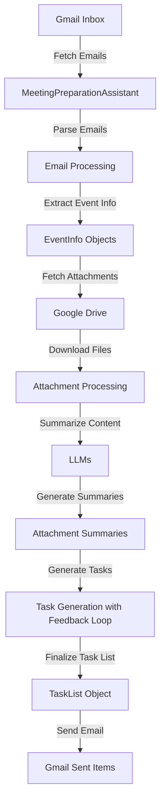

# Meeting Preparation Assistant

This repository contains the **Meeting Preparation Assistant**, a Python application that automates the process of preparing for upcoming meetings by:

- Fetching meeting invitations from Gmail.
- Extracting event details and attachments.
- Summarizing attachment content using LLMs.
- Generating a list of preparatory tasks with a human-in-the-loop feedback mechanism.
- Sending the finalized task list back to the user via email.

## Table of Contents

- [Meeting Preparation Assistant](#meeting-preparation-assistant)
  - [Table of Contents](#table-of-contents)
  - [Features](#features)
  - [Architecture](#architecture)
  - [Prerequisites](#prerequisites)
  - [Installation](#installation)
  - [Setting Up Google API Credentials](#setting-up-google-api-credentials)
    - [Enabling APIs](#enabling-apis)
    - [Creating OAuth 2.0 Client Credentials](#creating-oauth-20-client-credentials)
    - [Obtaining `token.json`](#obtaining-tokenjson)
  - [Running the Application](#running-the-application)
  - [Usage](#usage)

## Features

- **Email Processing**: Scans your Gmail inbox for new meeting invitations containing `.ics` calendar files.
- **Event Extraction**: Parses `.ics` files to extract event details like title, description, timing, and attendees.
- **Attachment Handling**: Downloads and processes various attachment types from Google Drive, including Google Docs, Sheets, Slides, PDFs, and plain text files.
- **Content Summarization**: Uses LLMs to summarize the content of attachments.
- **Task Generation**: Generates a list of preparatory tasks for the meeting, incorporating human feedback in up to three iterations.
- **Email Notifications**: Sends the finalized task list back to the user via email.

## Architecture

The application follows a modular design, integrating multiple Google APIs and LLMs. Below is an architecture diagram illustrating the flow of data and processes:



## Prerequisites

- Python 3.8 or higher
- Google Cloud Platform account
- Necessary Google APIs enabled:
  - Gmail API
  - Google Drive API
  - Google Docs API
  - Google Sheets API
  - Google Slides API
  - Google Calendar API

## Installation
**Install dependencies**

   ```bash
   pip install -r requirements.txt
   ```

## Setting Up Google API Credentials

To interact with Google APIs, you'll need to set up OAuth 2.0 credentials and obtain a `token.json` file.

### Enabling APIs

1. **Go to the [Google Cloud Console](https://console.cloud.google.com/apis/dashboard).**
2. **Create a new project** or select an existing one.
3. **Enable the following APIs** for your project:
   - Gmail API
   - Google Drive API
   - Google Docs API
   - Google Sheets API
   - Google Slides API
   - Google Calendar API

### Creating OAuth 2.0 Client Credentials

1. **Navigate to the [APIs & Services > Credentials](https://console.cloud.google.com/apis/credentials) page.**
2. **Click on "Create Credentials" and select "OAuth client ID".**
3. **Configure the consent screen** if prompted.
4. **Choose "Desktop app" as the application type.**
5. **Download the `credentials.json` file** and place it in the root directory of the project.

### Obtaining `token.json`

1. **Run the following script** to generate the `token.json` file:

   ```bash
   python get_token.py
   ```

   Create a new file named `get_token.py` with the following content:

   ```python
   from google_auth_oauthlib.flow import InstalledAppFlow
   import os
   import pickle

   SCOPES = [
       "https://www.googleapis.com/auth/calendar.readonly",
       "https://www.googleapis.com/auth/drive.readonly",
       "https://www.googleapis.com/auth/documents.readonly",
       "https://www.googleapis.com/auth/spreadsheets.readonly",
       "https://www.googleapis.com/auth/presentations.readonly",
       "https://www.googleapis.com/auth/gmail.send",
       "https://www.googleapis.com/auth/gmail.readonly",
       "https://www.googleapis.com/auth/gmail.modify",
   ]

   def main():
       flow = InstalledAppFlow.from_client_secrets_file('credentials.json', SCOPES)
       creds = flow.run_local_server(port=0)
       with open('token.json', 'w') as token:
           token.write(creds.to_json())

   if __name__ == '__main__':
       main()
   ```

2. **Follow the authentication steps** in your browser to authorize the application.

3. **A `token.json` file will be generated** in your project directory.

**Note**: Keep your `credentials.json` and `token.json` files secure and do not commit them to version control.


## Running the Application

Ensure that your virtual environment is activated and run:

```bash
python main.py
```

**Note**: The application will run indefinitely, checking for new meeting invitations every 5 minutes.

## Usage

1. **Email Processing**

   - The application scans your Gmail inbox for new emails containing `.ics` attachments (calendar invites).
   - It filters out emails already labeled as "Processed".

2. **Event Extraction**

   - Parses `.ics` files to extract event details.
   - Uses an LLMs to determine if the email is a meeting invitation.

3. **Attachment Handling**

   - Downloads and processes attachments from Google Drive.
   - Supports Google Docs, Sheets, Slides, PDFs, and text files.

4. **Content Summarization**

   - Summarizes attachment content using LLMs.

5. **Task Generation with Feedback Loop**

   - Generates a list of preparatory tasks.
   - Incorporates up to three iterations of human feedback to refine the tasks.

6. **Email Notification**

   - Sends the finalized task list back to you via email.

---

**Disclaimer**: This application uses sensitive scopes that provide access to your Gmail and Google Drive data. Ensure you understand the implications and secure your credentials appropriately.